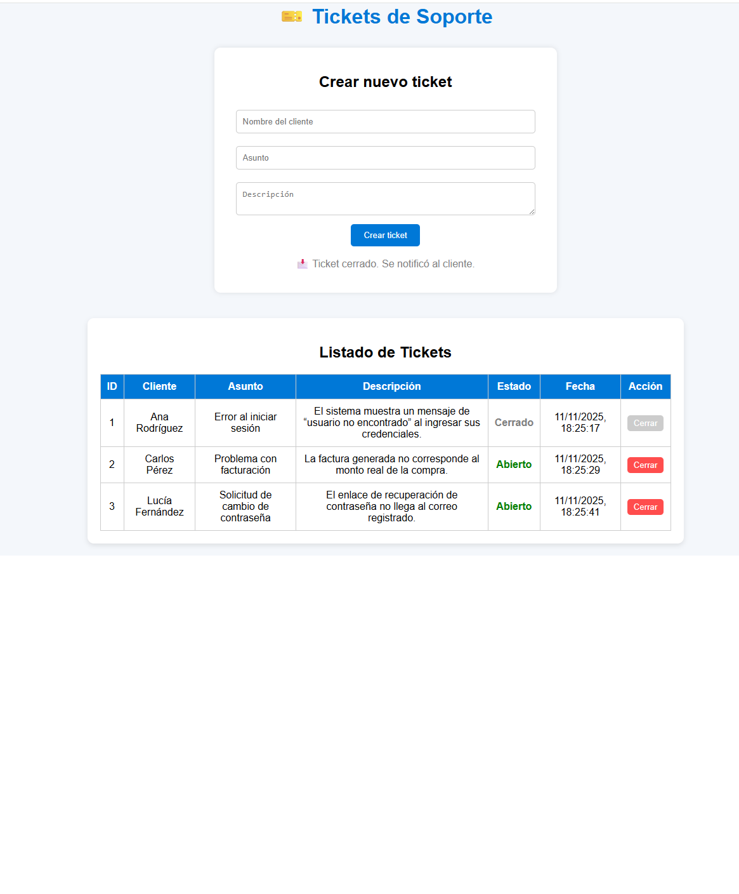

# 🎫 Sistema de Tickets de Soporte

**Autor:** Gerson Donato Flores Dalia  
**Repositorio:** [https://github.com/gersondbg/Tickets_Soporte](https://github.com/gersondbg/Tickets_Soporte)  
**Fecha:** Noviembre 2025  

---

## 📘 Descripción
Aplicación web desarrollada con **HTML, CSS y JavaScript** que simula un sistema de soporte técnico.  
Permite registrar nuevos tickets, mostrarlos en una tabla y actualizar su estado entre **“Abierto”** y **“Cerrado”**.  
El manejo de datos se realiza mediante una API simulada implementada en JavaScript (sin servidor ni base de datos).

---

## 🚀 Funcionalidades principales
- Formulario para registrar tickets de clientes.  
- Validación básica de campos vacíos.  
- Mensajes de éxito o error.  
- Listado dinámico de tickets.  
- Botón para cerrar tickets.  
- API simulada con JavaScript puro.  

---

## 🗂️ Estructura del proyecto
Tickets_Soporte/
├── index.html
├── style.css
├── script.js
├── formulario-api.service.js
└── README.md

---

## 🧩 Cómo ejecutar el proyecto
1. Abre la carpeta en **Visual Studio Code**.  
2. Instala la extensión **Live Server**.  
3. Haz clic derecho sobre `index.html` → **Open with Live Server**.  
4. El navegador abrirá la aplicación en `http://127.0.0.1:5500/`.  

---

## 🧾 Requisitos
- Navegador actualizado (Google Chrome, Edge o Firefox).  
- Editor recomendado: Visual Studio Code.  
- Extensión opcional: **Live Server**.  

---

## 🖼️ Vista previa

---

## 🧑‍💻 Créditos
Proyecto desarrollado por **Gerson Donato Flores Dalia**  
 
